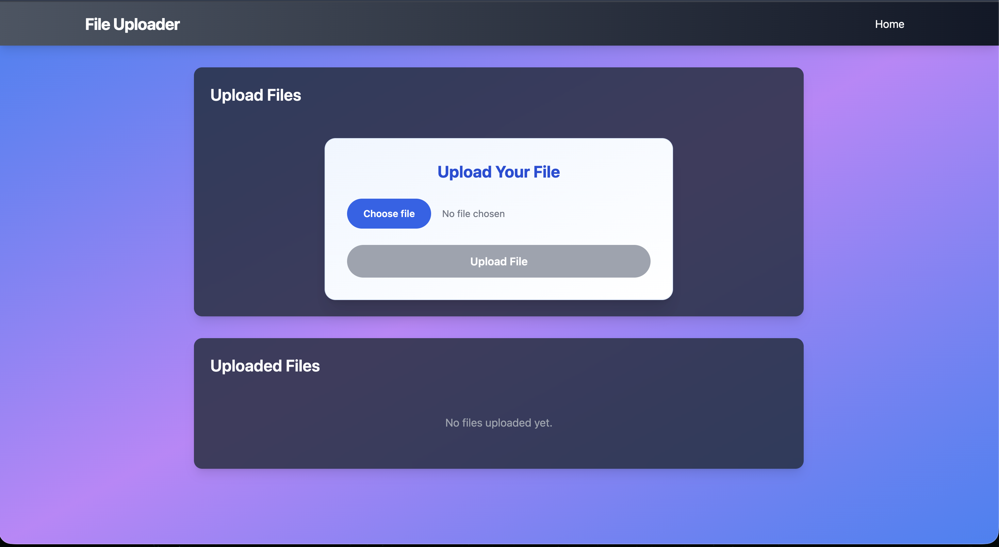

# Progress File Uploader

A **File uploader** application that allows users to upload files (images, PDFs, documents) and store them securely in **AWS S3**. File metadata is saved in **MongoDB**.

---

## Features

* Upload files (images, PDFs, text files)
* Store files in **AWS S3** securely
* Save metadata (file name, S3 URL, upload time) in **MongoDB**
* Display uploaded files in a list with download links
* Responsive frontend built with React
* RESTful API backend with Node.js + Express

---

## Tech Stack

* **Frontend:** React, Axios, HTML, CSS, JavaScript
* **Backend:** Node.js, Express
* **Database:** MongoDB (Mongoose)
* **Cloud Storage:** AWS S3
* **Other Tools:** Multer, AWS SDK, dotenv

---

## Installation

### Prerequisites

* Node.js (v16+)
* MongoDB (local or Atlas)
* AWS account with S3 bucket
* npm or yarn

---

### Backend Setup

1. Clone the repository:

```bash
git clone https://github.com/priyanshpolra/Progress_File_Uploader.git
cd Progress_File_Uploader/backend
```

2. Install dependencies:

```bash
npm install
```

3. Create a `.env` file:

```env
PORT=5000
MONGO_URI=<Your MongoDB Connection String>
AWS_ACCESS_KEY_ID=<Your AWS Access Key>
AWS_SECRET_ACCESS_KEY=<Your AWS Secret Key>
AWS_BUCKET_NAME=<Your S3 Bucket Name>
AWS_REGION=<Your AWS Region>
```

4. Start the backend server:

```bash
npm run dev
```

Server will run on `http://localhost:5000`.

---

### Frontend Setup

1. Navigate to frontend:

```bash
cd ../frontend
```

2. Install dependencies:

```bash
npm install
```

3. Start frontend:

```bash
npm start
```

Frontend will run on `http://localhost:3000`.

---

## Usage Guide (with Screenshots)

### 1. Open App

Open the React app in your browser: `http://localhost:3000`



---

### 2. Select File

Click **Choose File** and select a file from your computer.

---

### 3. Upload File

Click **Upload**. The file will be uploaded to **AWS S3**, and metadata will be stored in **MongoDB**.

---

### 4. View Uploaded Files

Uploaded files appear in a list with options to **Download** or **Delete**.

---

### 5. MongoDB Metadata

File metadata is stored in MongoDB:

| Field        | Description         |
| ------------ | ------------------- |
| `filename`   | Original file name  |
| `url`        | S3 file URL         |
| `uploadedAt` | Timestamp of upload |


---

## Folder Structure

```
Progress_File_Uploader/
│
├── backend/          
│   ├── controllers/  # API logic
│   ├── models/       # MongoDB schemas
│   ├── routes/       # Express routes
│   └── server.js     # Entry point
│
├── frontend/         
│   ├── src/
│   │   ├── components/ # React components
│   │   ├── pages/      # Pages
│   │   └── App.js
│
├── screenshots/       # Screenshots for README
└── README.md         
```

---

## API Endpoints

| Method | Endpoint       | Description                  |
| ------ | -------------- | ---------------------------- |
| POST   | /api/files     | Upload a file to S3          |
| GET    | /api/files     | Get all uploaded files       |
| GET    | /api/files/:id | Get a specific file metadata |
| DELETE | /api/files/:id | Delete a file from S3        |

---

## Contributing

1. Fork the repo
2. Create a feature branch: `git checkout -b feature/my-feature`
3. Commit changes: `git commit -m "Add some feature"`
4. Push branch: `git push origin feature/my-feature`
5. Open a Pull Request

---

## License

MIT License. See [LICENSE](LICENSE) for details.

---

## Author

**Priyansh Polra**

* GitHub: [@priyanshpolra](https://github.com/priyanshpolra)
* LinkedIn: [Priyansh Polra](https://www.linkedin.com/in/priyanshpolra/)

---

